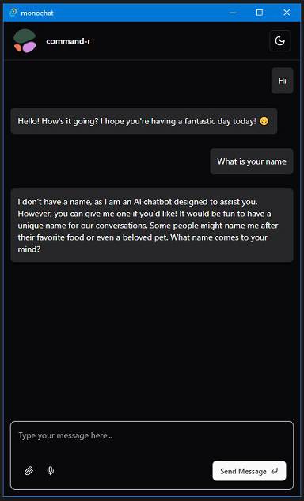

# Monochat
A cross-platform LLM  chat application written in Tauri. Compatible with Windows, MacOS, Linux, Android and iOS.

# TODO

 - [x] Basic application
 - [ ] Add more model providers
  - [ ] OpenAI
  - [ ] Anthropic
  - [ ] Google
  - [ ] LM Studio
 - [ ] Provide easy accessibility
 - [ ] Ability to utilize web search
 - [ ] Ability to utilize tools
 - [ ] Ability to add personas with temporary personas and longterm personas (similar to Huggingchat Assistants)
 - [ ] Ability to retain long-term memory in personas
 - [ ]

# Contribution

Any form of contribution is gladly appritiated.
